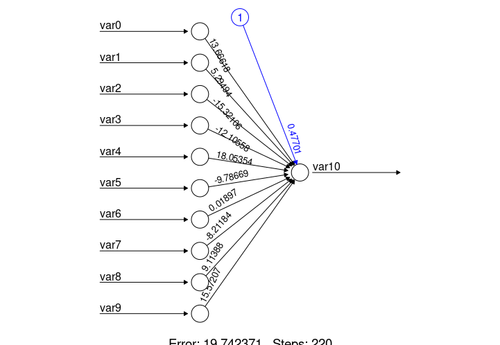

# TensoFlow 2 Tutorials
by [Lindo Khoza](https://www.linkedin.com/in/lindo-khoza-606b7817b/) / [Github](https://github.com/willkhoza)

## TensorFlow 2 - Tutotial 01

Tutorial 1 is about building a simple linear nueral network in Keras. The word Keras will almost be used interchangebly with TensorFlow 2. There is a concrete difference but that is outside the scope of these Tutorials. But for completeness, Keras is just a mask for TensorFlow 2, allowing the standard user to build TensorFlow 2 models in a manner easier than working with pure TensorFlow 2 code. 

The simple linear nueral network is an example of what is called supervised models. These are models in which you have both the covariates and the so called dependent variable. 

Other models include unsupervised models, these are models built on solely having just the covariates, a common strategy in this case is to pursue some sort of clustering in order to generate insight from that. There's also an interesting group of models called reinforcement learning, these are built on bayesian logic, where the model improves through trial and error while navigating some enviroment.

### Generate Multiple Linear Regression Data

#### Background

The structure of a simple linear nueral network can never model non-linear regressions, regardless of how complex you arrange it. This is because all that a nueral network is convolutions of multiple functions. As such, the convolution of linear functions inside other linear functions is still a linear function. 

In order to accomodate more complex dependencies in the data, you will use something called activatyion functions. This will allow your nueral network the mathematical structure it requires to model non-linear regressions. This is discussed in [Tutorial x](linkhere.com).

#### Notes

The intention behind generating linearly regressed data is to be able to study the nueral network in it's simplest form. The use of this structure of nueral network is very limited, and possibly counterintuive as will be seen shortly. Albeit, this is an important step, so much so that I've made a Python script that is dedicated to generating this multiple linear regression dataset.

The [python script](00_simulate_data.py) generates a csv with an arbitrary amount of covariates and observations, the last column being variable we seek to model in our supervised model. The data generated has a linear relationship together with a little bit of noise. Some of the covariates produced a not related to the dependent variables, so the analyst still has the obligition to identify this dependance.

### Do the anlytical due dilligence in R

#### Linear Regression model

We build a standard linear regression model in R. This model has statistical integrity attached with it together with the appropriate assumptions. These include normality assumptions and other things.

#### Using Neuralnet to build a gimic nueral network   

We then build the very same model we seek to produce in Keras. The R model is relatively straight forward to build using Neuralnet. It doesn't require the statistical assumptions required in the linear model, as such, it may be more or less preferable to the former model based on the this. 

### Build a simple nueral network in Keras

#### Create a sequential nn model 

1. read the data using Pandas
2. Stack up a sequential model, a sequential model is equivalent to a list of layers, you can add and remove layers as you wish. Advanced users may find the structure of a sequential model restrive, but standard users should be able to get the most out of this.
    - this model has dense layers
    - this model has no hidden layers
    - the model only has an input and an output layer as shown in the above diagram
    - explicitly define the output layer so as to have access to the weights
    - you do have the option to implicitly define the layer if you don't want to have access to the weights
    - The output layer takes in a tensor of 10x1 float64 values and outputs a tensor made up of just 1 value.
out_layer = tf.keras.layers.Dense(units=1)
model = tf.keras.Sequential([out_layer])
3. the following restrictions apply to our model
    - the output layer must output a tensor with a shape matching the shape of the dependent variable
    - In the above instance, it wouldn't make sense for the output layer to have more than 1 nodes, because the output tensor would be a 2x1 tensor, how do we calculate the mean square error of a 2x1 prediction vs a 1x1 output? So ensure to take care of care of this small detail, especially when working with classes, in that case you would require a sofmax output layer with the same number of nodes as there are classes. This will be discuessed in more detail when the time comes.
    - A sequential model accepts one input tensor and gives out one output tensor.
    - A tensor equivalent in linear algebra theory is the equivalent of an matrix or a vector of numbers.

### compile model
1. Specify the optimization metrics (your loss function) relevent to your model, here are some examples:
    - Mean Square Error (continous dependent variable)
    - Categorical Cross Entropy (categorical dependent variable)

2. Specify the optimisation strategy and the rate associated with that strategy. A value between 0.001 and 0.1 will be appropriate. In real life situations, you will have to trial and error through different values to meet the requirements for your model.
    - Adam(learning_rate=0.1)
model.compile(loss="mse", optimizer=tf.keras.optimizers.)

### Fit your sequential model
1. Specify the number of iterations the training needs to do. This value is called epochs. Each epoch corresponds to one complete run through all the observations.
2. Alternatively you can specify the error threshold assocaited with you training.
3. Capture the loss trajectory on the history variable, and use this to evaluate the training of the model.
4. The epochs and/or threshold are also model dependent.
5. Verbosity specifies whether the logging should be done or not. A value of true will mean that a lot of logging will be reported on the console.